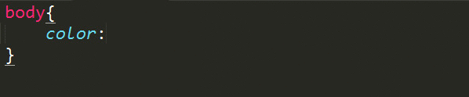

colorToVal
-------------
一个输入颜色的16进制可转为对应变量的Sublime Text 3自动完成插件。

#####插件效果：（colorToVal）

<!-- #### 安装(Package Control)
* Ctrl+Shift+P 输入 Package Control: Install Packag
* 搜索 colorToVal
* 重启 Sublime Text -->

#### 安装(github)
* Ctrl+Shift+P 输入 Package Control: Add Repository
* 添加git地址 https://github.com/yh418807968/colorToVal
* Ctrl+Shift+P 输入 Package Control: Install Package
* 搜索 colorToVal
* 重启 Sublime Text

##### 配置参数

参数配置文件：Sublime Text -> Preferences -> Package Settings -> colorToVal -> setting-Default

* `exts` - 启用此插件的文件类型。默认为：[".css", ".scss", ".less", ".sass", ".styl"]。
* `data` - 用户自定义的数据。默认举例为：
	"data":{
    
			"$c-bg1":"#dadada",
			"$c-night":"#dee",
			"$c-bg2-night":"#dee",
			"$c-bg3":"#fff",    
	}。
	用户在setting-User中设置数据后，可将此处删除。

@ youhong SOHU SNS FE-Group
